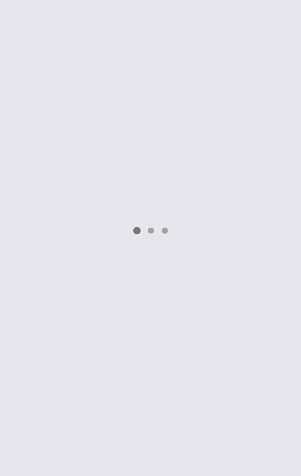

# react-native-three-dots-loader
Simple react native animated loader
<p>


</p>

Component doesn't use external libs, only `Animated` from react-native

## Installation
`yarn add react-native-three-dots-loader`

## Usage



`import Loader from 'react-native-three-dots-loader'`

...

```
return (
  <Loader>
)
```

## Props

| Prop | Description |
| :------------ | :-----|
| size | Dot size |
| background | Dot background |
| activeBackground | Active dot background |
| dotMargin | Dots horizontal margin |
| animationDuration | Scale animation duration |
| animationScale | Maximum scale |